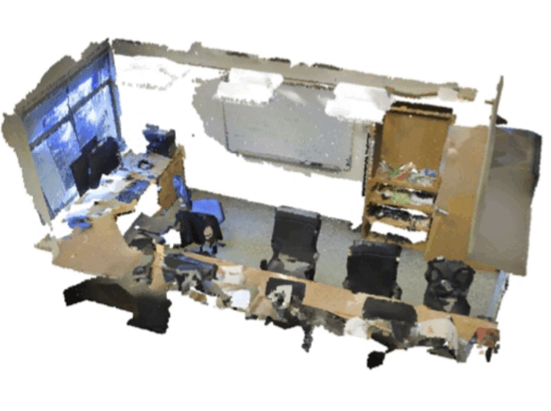

# PointNet with Self-Attention residual layers

This repository is an implementation of a final course project that studied the most influential neural architecture for Point Cloud processing called PointNet with the ambition to improve its accuracy using Self-Attention Layers from the famous Transformer architecture. A report with explanations for this study can be found [here](https://leobringer.files.wordpress.com/2023/09/written-report.pdf).

&nbsp;

  Some visual results of the Semantic Segmentation algorithm:
   
  

&nbsp;

# Contents

[***Objective***](https://github.com/leob03/PointNet_Self_Attention#objective)

[***Concepts***](https://github.com/leob03/PointNet_Self_Attention#concepts)

[***Dependencies***](https://github.com/leob03/PointNet_Self_Attention#dependencies)

[***Resultss***](https://github.com/leob03/PointNet_Self_Attention#results)

# Objective

**While processing Point Clouds with machine learning methods is inherently challenging due to point cloud’s irregularities and complexities, PointNet architecture has been developed to efficiently process point clouds by using multi-layer perceptrons (MLPs) and symmetric function. The architecture can be easily adapted to perform 3D recognition tasks such as classification, part segmentation, and semantic parsing, and achieve state-of-the-art performance. However, PointNet does not capture local structures induced by the metric space because of only applying elementary binary symmetric or aggregation operations, treating each points separately. This work aims to address this limitation by incorporating self-attention mechanism with positional encoding to capture local features. The extended architecture is able to achieve 3 percent increase in accuracy at 3D classification task, and detailed analysis of the architecture is provided.**

# Concepts

Most of the concepts are described quite in depth in the paper but here is a quick summary of the main concepts exploited in this project:

* **Point-Cloud processing**. Point cloud processing involves handling and analyzing data that represents a set of points in three-dimensional space. Each point in the cloud typically contains information about its spatial coordinates and may include additional attributes like color or intensity. Point cloud processing techniques are used in various applications such as 3D reconstruction, object recognition, autonomous driving, and environmental modeling. The goal is to extract meaningful information, perform geometric analysis, and apply machine learning algorithms to understand and interact with the 3D world captured by the point cloud data.

* **Attention**. Originally attention functions have been introduced as an improvement from Residual Neural Networks (RNN) that struggle to deal with long-range dependencies in sequence to sequence transduction tasks. Indeed, in RNNs, the input sequence is bottlenecked through a fixed-size vector called the context vector which results in a significant loss of information for long-range input sequences and a lack of consideration to local features. So this new idea of attention function introduced in the famous paper ”Attention is all you need”[4], uses a new context vector at each step of the output sequence to ”look at” different parts of the input sequence and consider local features.

* **Shape Classification**. Shape classification involves categorizing or classifying 3D shapes into predefined categories or classes based on their geometric properties and features. The goal is to assign each shape to the most appropriate category, enabling shape recognition and organization in various applications, such as computer-aided design, object recognition, and medical imaging.

* **Part Segmentation**. Part segmentation, on the other hand, focuses on dividing a 3D shape into its constituent parts or components. The objective is to segment the shape into meaningful subregions or parts, each corresponding to a specific component or structure. Part segmentation is valuable in tasks like object analysis, shape reconstruction, and understanding the functional components of complex shapes, such as objects or human anatomy.

# Dependencies
**Python 3.10**, modern version of **PyTorch**, **numpy** and **scipy** module. Most of these are okay to install with **pip**. To install the rest of the dependencies all at once, run the command `./install.sh`

I only tested this code with Ubuntu 20.04, but I tried to make it as generic as possible (e.g. use of **os** module for file system interactions etc. So it might work on Windows and Mac relatively easily.)

# Results

