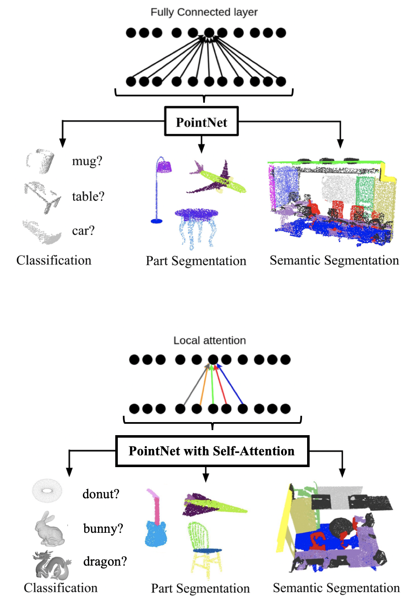

# PointNet with Self-Attention residual layers
This repository is an implementation of a final course project that studied the most influential neural architecture for point cloud understanding called PointNet with the ambition to improve its accuracy using Self-Attention Layers from the famous Transformer architecture.

  

